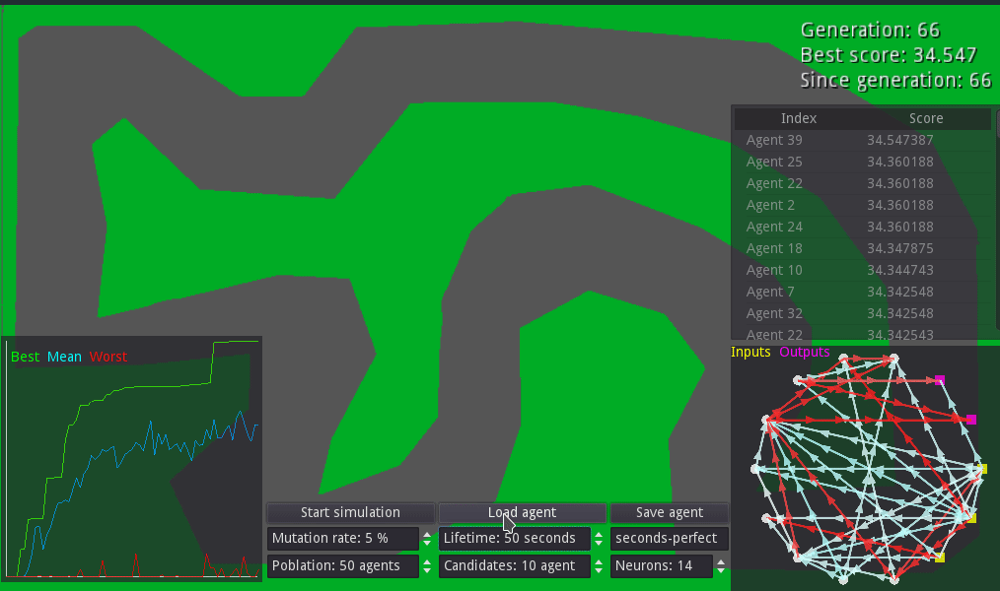

# Geode
##### Evolving Artificial Neural Network Agents in Godot Engine using C++

> A racing car agent after 66 generations evolving

This project aims to create a framework in Godot engine for fast creating and testing simulations of neural network agents evolved by a genetic algorithm. Logic is written in c++11 and highly uses concuency. Godot version used is 3.0 beta 2 over GNU/Linux x64.

## ¿What can it do?
As you can see in the gif, it can simulate the beahaviour of some custom agents on a custom simulation by creating a neural network for each one. You can set a custom fitness function for eval them and a genetic algorithm will generate a new population for you when all of them die. The results of the simulation can be shown in real time not only seeing the agents living but studying its network and some basic statistics. Simulation allows using an arbitry number of neurons.

## I don't know what I'm seeing on the gif

- Plot panel (bottom left): shows the fitness of each generation by representing best, mean, and worst score. Its updated every new generation.

- Score panel (middle right): shows a list of all agents currently in the scene ordered by its score (which is also shown). You can select an agent here to see its network and save it.

- Network panel (bottom right): shows a circular representation of the network of the currently selected agent. Nodes in the circle are the neurons, where white circles are regular neurons, yellow squares are inputs and purple squeres ouputs. The axons are represented by arrows, and depending of its color are positive (red) or negative (blue).
More saturation indicates high values and less values near to 0

## Repository structure

The project is divided in two components: backend and frontend

- Backend: Contains the c++ code for both genetic algorithm and arificial neural network. It's designed with easy reutilisation on mind, none of its components talks directly with Godot engine. Documentation can be found [here](https://si-ull.github.io/Proyecto/index.html).

- Frontend: Currently contains a copy of the backend with minimal modifications, the bindings between Godot -GDNative- and backend (both code and linux x64 binary, we are working on instruction for compiling them) and some demostration scenes.

## Using it
We provide some scenes for handling the connections with c++ libraries, buttons and visual representations (the statistic plotter and network renderer) so you can focus on create your agent and the environment.
Currently they are not as "default abstract scenes" as they should, there are still some elements adjusted for our test simulations.

- Controller: contains the genetic algorithm and all GUI showed on gif above. It has a son called "AgentInstancer" in which you must spicify your agent scene and acts as the "born point" of them.

- Agent: receives from its intancer the information to generate its neural network and feed its entries in a `_physic_process`. Also they receive the time to be alive. Fitness function **is calculated by the agent** and passed to the genetic algorithm when it dies. Also here you must specify the number of input and output neurons used.

In order to create your own simulation, you only need to create a copy of agent scene and adjust it for your purposes. Create a new scene with the parameters of your simulation, add in it the controller and set the agent scene in it.
